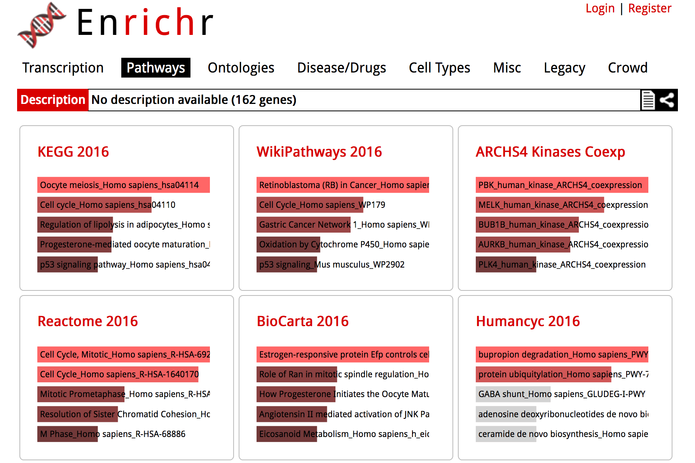
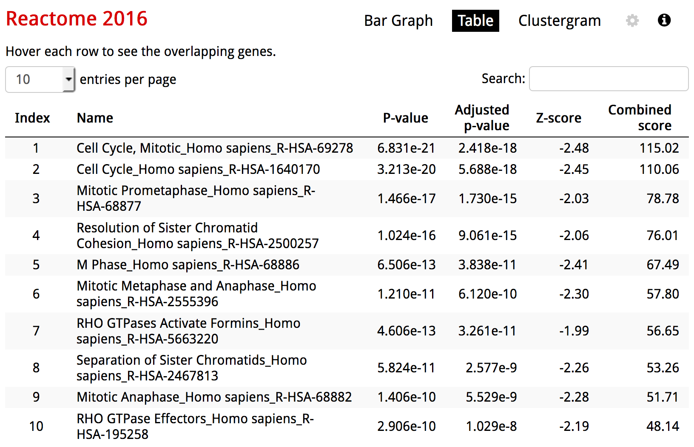
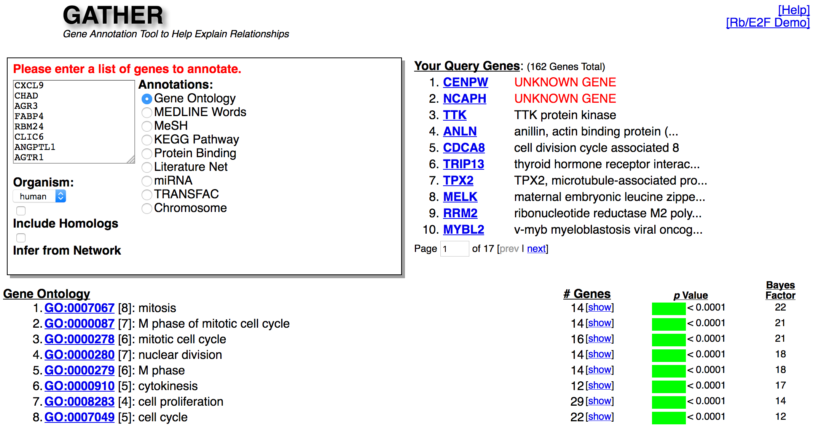
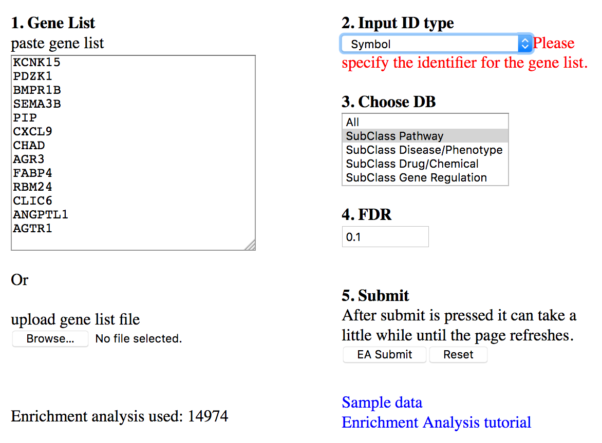
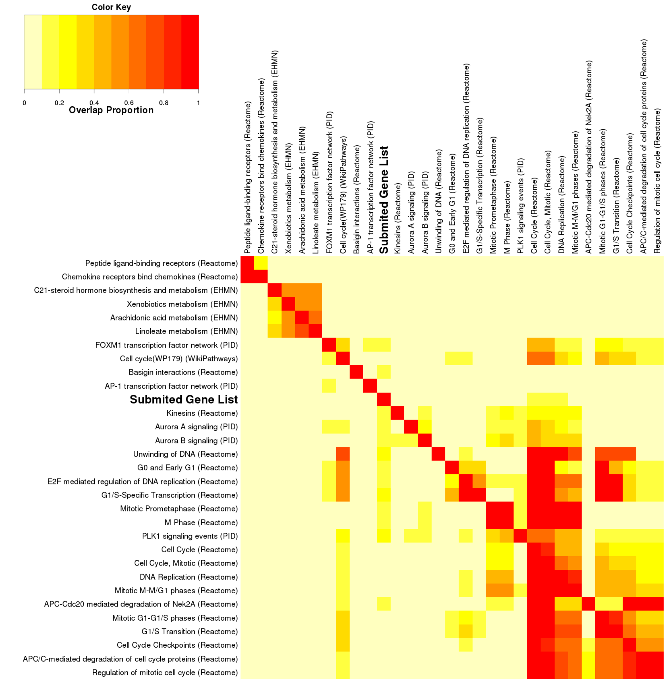
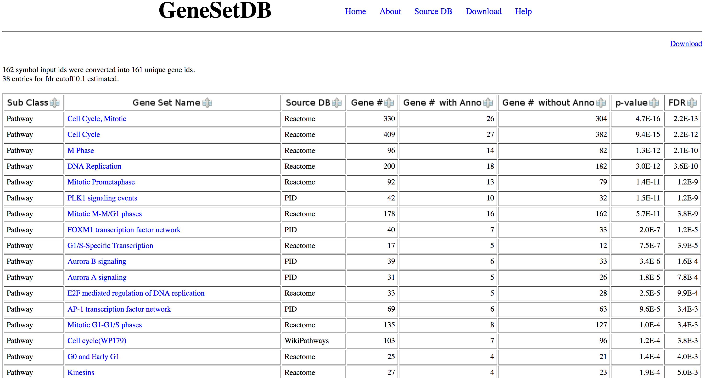
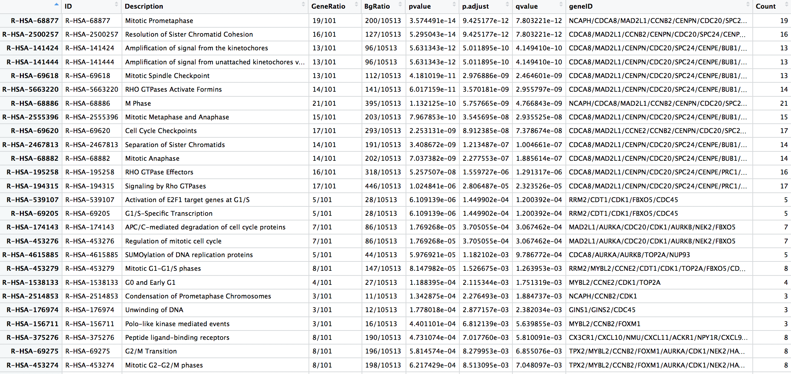
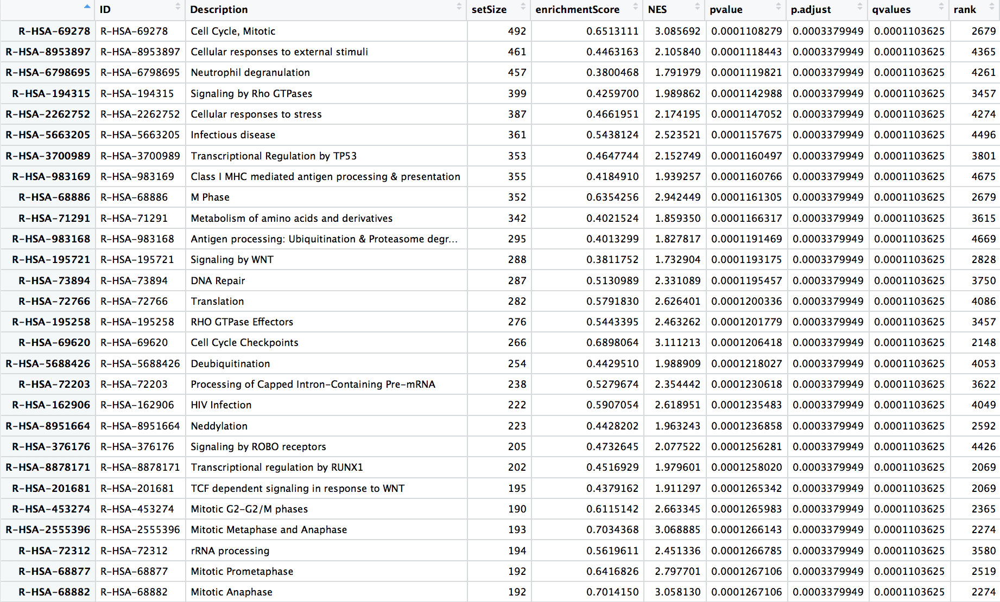

<!-- Run line below in R to render multiple documents: -->
<!-- rmarkdown::render(here::here("bioHPC_geneLists.Rmd"), output_format='all') -->

```{r setup, include=FALSE}
knitr::opts_chunk$set(echo = TRUE)
```

## Gene lists

 - There are __LOTS__ of situations where we might want to use a list of genes 
 to shed some biological light on our problem
 
 - Two typical situations:
     - List of genes (e.g., differentially expressed between two conditions) that we want to gain some more insight (e.g., by including some additional biological annotation)
     - List of gene representing a specific biological function (e.g., tissue-specific expression) that we would like to obtain an expression summary for.
 
## Common types of annotation

 - Pathways
    - Reactome
    - KEGG
    - WikiPathways
    - Biocarta
 - Ontologies
    - Gene Ontology
    - Human phenotypes
    - Tissue-specific expression

## Situation 1

 - Over-representation analysis
    - Enrichr
    - GATHER
    - GeneSetDB
 - Enrichment analysis
    - GSEA
    - Generic methods (limma): `roast`, `camera`, `wilcoxGST`
    
## Situation 2: Metagenes!

 - Dimension reduction to produce summary of multi-gene data
    - Centroids
    - Principal Components Analysis (PCA)
    - Singular Value Decomposition (SVD)
    - Mutlidimensional Scaling (MDS)
 - Relationship to clinical/phenotypic variables
 
 
## Example data set

 - Breast cancer data: Miller et al. (2005): `breastCancerUPP` package
    - 251 tumour samples on HGU133A/B Affymetrix microarrays
    - 44,928 probe sets
    - 10 clinical variables
 - Use these data to illustrate both situations described above (over-representation/enrichment and metagenes).
    
## Setup 

```{r, echo=FALSE}
library(breastCancerUPP)
library(ggplot2)
library(survival)
library(limma)
suppressPackageStartupMessages(library(reactome.db))
suppressPackageStartupMessages(library(ReactomePA))
suppressPackageStartupMessages(library(survminer))
suppressPackageStartupMessages(library(gplots))
suppressPackageStartupMessages(library(dplyr))
suppressPackageStartupMessages(library(gridExtra))
```

```{r, eval=FALSE}
## Load packages
library(breastCancerUPP)
library(ggplot2)
library(survival)
library(limma)
library(reactome.db)
library(ReactomePA)
library(survminer)
library(gplots)
library(dplyr)
library(WGCNA)
library(gridExtra)
```

```{r}
## Helper function for ggplot colours
gg_color_hue <- function(n) {
  hues = seq(15, 375, length = n + 1)
  hcl(h = hues, l = 65, c = 100)[1:n]
}
```

## Load breast cancer expression data

```{r}
data(upp)
expDat = exprs(upp)
upp
```

## Extract gene symbols

```{r}
symbols = fData(upp)$Gene.symbol
names(symbols) = fData(upp) %>%  rownames()
head(symbols)

symbols %>%  is.na() %>% sum()
drop_na = symbols %>%  is.na() %>% which()
head(drop_na, 4)
```

## Collapse probe-sets to symbols

 - `collapseRows` function in `WGCNA` package was used to generate per-gene data (e.g., single value when gene represented by multiple probe sets)
 - Default is to select the probe set with teh highest mean expression value.

```{r, cache=TRUE, eval=FALSE}
uppExpr = WGCNA::collapseRows(expDat[-drop_na,], 
                 rowGroup = symbols[-drop_na], 
                 rowID = names(symbols[-drop_na]))$datETcollapsed
saveRDS(uppExpr, file='uppsala-brca-perGene.rds')
```

## Examine collapsed data

```{r}
uppExpr = readRDS('uppsala-brca-perGene.rds')
dim(uppExpr)
head(uppExpr[,1:5])
```

## Extract clinical data

```{r}
uppClin <- pData(upp)
dim(uppClin)
names(uppClin)
```

## Extract relevant variables

```{r}
uppClin %>% is.na() %>%  colSums()
uppClin = uppClin[,c("size", "age", "er", "grade", "pgr", "node", 
                     "t.rfs", "e.rfs", "treatment")]
```

## Tidy up Grade and RFS time

```{r}
## Convert RFS time from days to years
uppClin$t.rfs = uppClin$t.rfs/365

## Convert grade from numeric (1,2,3) to G1, G2, G3.
uppClin$grade = paste0("G", uppClin$grade)
uppClin$grade[uppClin$grade=="GNA"] = NA

## Table of Grade vs ER status
table(uppClin$er, uppClin$grade, useNA='always', dnn=c("ER", "Grade"))
```

## Clinical data

```{r, eval=FALSE}
View(uppClin)
```

<center></center>

## Survival plot (RFS by Grade)

```{r, fig.height=4, fig.width=5}
ggsurvplot(survfit(Surv(t.rfs, e.rfs) ~ grade, data=uppClin), 
           pval = TRUE, risk.table = FALSE) + xlab("Time (years)")
```

## Differential expression (G1 vs G3)

```{r}
## Only keep samples which do not have NA values for grade
keep = which(!is.na(uppClin$grade))

## Create design marix for linear model analysis
design = model.matrix(~uppClin$grade)
head(design)
```

## Differential expression (G1 vs G3)

```{r, cache=TRUE}
## Fit linear model
fit = lmFit(uppExpr[, keep], design) 
fit = eBayes(fit)

## Extract results
g3_vs_g1 = topTable(fit, coef=3, n=nrow(uppExpr), 
                    adjust.method="holm")
## Identify significant genes
sig = g3_vs_g1$adj.P.Val < 0.01 

## Number of significant genes
sum(sig)
```

## Volcano plot

```{r, eval=FALSE}
volcanoplot(fit, coef=3)
points(g3_vs_g1$logFC[which(sig)], -log10(g3_vs_g1$P.Value[which(sig)]), 
       cex=0.4, col='red', pch=16)
abline(h = min(-log10(g3_vs_g1$P.Value[which(sig)])), lty=2, col='blue')
```

```{r, echo=FALSE, fig.height=4, fig.width=6}
par(mar=c(5, 4, 0, 2) + 0.1)
volcanoplot(fit, coef=3)
points(g3_vs_g1$logFC[which(sig)], -log10(g3_vs_g1$P.Value[which(sig)]), 
       cex=0.4, col='red', pch=16)
abline(h = min(-log10(g3_vs_g1$P.Value[which(sig)])), lty=2, col='blue')
```

## Add fold-change threshold

 - Can reduce the number of genes in our list by imposing a fold-change threshold
 - Here I've required genes to exhibit a fold-change of at least 2 (i.e., 1 on the $log_2$ scale) 
 between the groups.

```{r}
sigFC = (g3_vs_g1$adj.P.Val < 0.01)  & (abs(g3_vs_g1$logFC) > 1)
sum(sigFC)
```

## Volcano plot with FC threshold

```{r, eval=FALSE}
volcanoplot(fit, coef=3)
points(g3_vs_g1$logFC[which(sigFC)], 
       -log10(g3_vs_g1$P.Value[which(sigFC)]), 
       cex=0.6, col='red', pch=16)
abline(h = min(-log10(g3_vs_g1$P.Value[which(sigFC)])), lty=2, col='blue')
abline(v = c(-1,1), lty=2, col='blue')
```

```{r, echo=FALSE, fig.height=3.5, fig.width=5}
par(mar=c(5, 4, 0, 2) + 0.1)
volcanoplot(fit, coef=3)
points(g3_vs_g1$logFC[which(sigFC)], 
       -log10(g3_vs_g1$P.Value[which(sigFC)]), 
       cex=0.6, col='red', pch=16)
abline(h = min(-log10(g3_vs_g1$P.Value[which(sigFC)])), lty=2, col='blue')
abline(v = c(-1,1), lty=2, col='blue')
```

## Significant genes

```{r}
sigGenes = rownames(g3_vs_g1)[which(sigFC)]
sigGenes %>%  head(.,30)

strsplit(sigGenes, "///") %>%  unlist() %>%  unique() %>% length()
```

## Over-representation analysis: Enrichr

<center></center>

<BR>
http://amp.pharm.mssm.edu/Enrichr/

## Over-representation analysis: Enrichr

<center></center>

<BR>
http://amp.pharm.mssm.edu/Enrichr/

## Over-representation analysis: GATHER

<center></center>

<BR>
http://changlab.uth.tmc.edu/gather/gather.py

## Over-representation: GeneSetDB




<BR>
http://genesetdb.auckland.ac.nz

## Over-representation: GeneSetDB



<BR>
http://genesetdb.auckland.ac.nz

## Over-representation analysis in R

```{r}
reactome()
```

## Reactome data

```{r}
## Pathways and Entrez IDs (first 2 pathways, first 6 genes from each)
lapply( as.list(reactomePATHID2EXTID)[1:2], head )

## Pathway names (first 2)
as.list(reactomePATHID2NAME)[1:2]
```

## `ReactomePA`

```{r, cache=TRUE}
## Convert gene list symbols to Entrez gene IDs
sigEntrez = fData(upp)$EntrezGene.ID[ match(sigGenes, 
                            fData(upp)$Gene.symbol) ] %>%  
            as.vector()
head(sigEntrez)

## Perform pathway analysis via ReactomePA
rPAoverrep <- enrichPathway(gene=sigEntrez, organism = "human", 
                            pvalueCutoff=0.05, readable=T)
```

## `ReactomePA` results

```{r, eval=FALSE}
rPAoverrep %>%  as.data.frame() %>%  View()
```

<center></center>

## `ReactomePA` visualisations

 - NB: `barplot.enrichResult` is from the `DOSE` pacakge.

```{r, fig.height=3, fig.width=8}
barplot(rPAoverrep, showCategory=11, font.size=8)
```

## `ReactomePA` visualisations

 - NB: `dotplot` is from the `DOSE` pacakge.
 
```{r, eval=FALSE}
dotplot(rPAoverrep, showCategory=11, font.size=8)
```

```{r, fig.height=3, fig.width=8, echo=FALSE}
par(mar=c(5, 4, 10, 2) + 0.1)
dotplot(rPAoverrep, showCategory=11, font.size=8)
```

## `ReactomePA`: GSEA

```{r}
tstats = g3_vs_g1$t
names(tstats) = fData(upp)$EntrezGene.ID[ match(rownames(g3_vs_g1), 
                            fData(upp)$Gene.symbol) ] %>%  
                as.vector()
tstats = sort(tstats, decreasing=TRUE)
head(tstats)
```

```{r, cache=TRUE}
rPAgsea = gsePathway(tstats, nPerm=10000,
                     minGSSize=50, pvalueCutoff=0.2,
                     pAdjustMethod="BH", verbose=FALSE)
```

## `ReactomePA`: GSEA results

```{r, eval=FALSE}
rPAgsea %>%  as.data.frame() %>%  View()
```

<center></center>

## `ReactomePA`: GSEA plot

```{r, fig.width=8, fig.height=4.8}
gseaplot(rPAgsea, geneSetID = "R-HSA-69278")
```

## Heatmaps

 - Heatmaps are a great way to visualise the expression patterns of gene sets
 across samples.
    - Incredibly overused (especially by me), and rather easy to abuse.
    - Popular to use in conjunction with hierarchical clustering of rows (genes)
    and columns (samples).
 - Clusters often extracted for comparison with clinical/phenotypic variables.
 - Let's have a look at the expression of the genes in our list.

## Heatmap setup

```{r}
## Extract expression data for gens of interest
uppExprSig = uppExpr[match(sigGenes, rownames(uppExpr)), ]
dim(uppExprSig)

## Use ggplot colours for Grades
gradeCols = gg_color_hue(3)[as.numeric(as.factor(uppClin$grade))]

## Identify which samples are Grade 1 or 3
g1_g3 = uppClin$grade%in%c("G1", "G3") %>%  which()
```

## Heatmap: G1 & G3

```{r, warning=FALSE, fig.height=4, fig.width=8}
heatmap.2(uppExprSig[,g1_g3], col=bluered(30), trace='none', 
          scale='row', ColSideColors = gradeCols[g1_g3], key=FALSE,
          breaks=seq(-3,3,l=31), labCol="", labRow="", mar=c(0,0))
```

## Heatmap: all grades

```{r, warning=FALSE, fig.height=4, fig.width=8}
heatmap.2(uppExprSig, col=bluered(30), trace='none', 
          scale='row', ColSideColors = gradeCols, key=FALSE,
          breaks=seq(-3,3,l=31), labCol="", labRow="", mar=c(0,0))
```

## Cluster groups

```{r}
clusterGroups = uppExprSig %>%  t() %>% dist() %>%  
  hclust() %>% cutree(., 3)

table(clusterGroups)

table(clusterGroups, uppClin$grade)
```

## Gene expression summaries

 - The clusters appear to relate (to some extent) to the tumour grades.
 - What if we want a continuous-valued variable to represent gene expression for each sample?
    - Can sometimes use the _centroid_ (mean of genes in set per sample - column means here)
    - This works well when all the genes have a similar pattern...
    
```{r}
centroid = colMeans(uppExprSig)
head(centroid)
```

## Centroid boxplot

```{r, fig.height=3.5, fig.width=4.5}
data.frame(centroid = centroid, grade=as.factor(uppClin$grade)) %>% 
     na.omit() %>% ggplot(., aes(x=grade, y=centroid, fill=grade)) + 
     geom_boxplot() + ggtitle("Centroid vs Grade")
```

Here it doesn't provide any distinction between grades.

## Metagenes

 - Dimension reduction technqiues are commonly used to generate metagenes:
    - SVD/PCA/MDS
    - these are all basically the same: https://github.com/mikblack/msg-pca-20171114
    
 - Other methods also exist:
    - Non-negative matrix factorisation (NMF)
    - Generally gives similar results to methods above

## Metagene creation

```{r}
pca = uppExprSig %>% scale(., scale=FALSE) %>%  t() %>%  prcomp()
metagene = pca$x[,1:3]
head(metagene)
```

## Percentage variance explained

```{r, fig.height=3.5}
screeplot(pca)
```

Most of the variance is explained by the first eigenvector / PC.

## Heatmap ordered by Metagene 1

```{r, fig.height=3.5, fig.width=8, warning=FALSE}
ord = order(metagene[,1])
mgCols = bluered(nrow(metagene))[rank(metagene[,1])]
heatmap.2(uppExprSig[, ord], col=bluered(30), trace='none', Colv=FALSE,
          scale='row', ColSideColors = mgCols[ord], key=FALSE,
          breaks=seq(-3,3,l=31), labCol="", labRow="", mar=c(0,0))
```

## Setup for grade plots

```{r}
p1 = data.frame(PC1 = metagene[,1], grade=as.factor(uppClin$grade)) %>% 
     na.omit() %>% ggplot(., aes(x=grade, y=PC1, fill=grade)) + 
     geom_boxplot() + ggtitle("Metagene 1")

p2 = data.frame(PC2 = metagene[,2], grade=as.factor(uppClin$grade)) %>% 
     na.omit() %>% ggplot(., aes(x=grade, y=PC2, fill=grade)) + 
     geom_boxplot() + ggtitle("Metagene 2")

p3 = data.frame(PC3 = metagene[,3], grade=as.factor(uppClin$grade)) %>% 
     na.omit() %>% 
     ggplot(., aes(x=grade, y=PC3, fill=grade)) + 
     geom_boxplot() + ggtitle("Metagene 3")
```


## Metagenes versus Grade

```{r, fig.width=8, fig.height=3}
grid.arrange(p1, p2, p3, ncol=3)
```

First metagene is strongly associated with grade: provides a good continuous-valued 
summary of proliferation level.

## Genomic grade

 - In their 2005 publication, Miler et al. used "proliferation level" to split 
 the Grade 2 tumours into two groups.
    - low proliferation Grade 2 tumours behave like Grade 1
    - high proliferation Grade 2 tumours behave like Grade 3
 - This result was validated in other data sets.
 - Let's try the same thing here.

## Genomic Grade

```{r}
prolif = ifelse(metagene[,1] < median(metagene[,1]), "High", "Low")
table(prolif, uppClin$grade)

uppClin$gGrade = uppClin$grade
uppClin$gGrade[uppClin$grade=="G2" & prolif=="High"] = "G2/G3"
uppClin$gGrade[uppClin$grade=="G2" & prolif=="Low"]  = "G2/G1"
table(uppClin$gGrade)
```

## Survival plot (RFS vs Genomic Grade)

```{r, fig.height=4, fig.width=6}
ggsurvplot(survfit(Surv(t.rfs, e.rfs) ~ gGrade, data=uppClin), 
           pval = TRUE, risk.table = FALSE) + xlab("Time (years)")
```

## Metagenes from Reactome pathways

```{r}
reactomePath = as.list(reactomePATHID2NAME)
reactomePath = reactomePath[grep("Homo sapiens", reactomePath)]
reactomePath[ grep('immune', reactomePath, ignore.case = TRUE)] %>% 
  head(.,3)
```

## Metagenes from Reactome pathways

```{r}
## Get Entrez IDs for genes in Cytokine Signalling pathway
pathRows = as.list(reactomePATHID2EXTID)["R-HSA-1280215"] %>%  
  unlist() %>%  match(., fData(upp)$EntrezGene.ID) %>%  
  na.omit() %>%  as.vector()
head(pathRows)

## Extract expression data for these genes
pathExprDat = uppExpr[fData(upp)$Gene.symbol[pathRows], ]
dim(pathExprDat)
```

## Immune response metagene 

```{r, fig.height=3.5}
## Use PCA to generate metagenes
pca = pathExprDat %>% scale(., scale=FALSE) %>%  t() %>%  prcomp()
metagene = pca$x[,1]
screeplot(pca)
```

## IR metagene vs survival (ER neg)

```{r, fig.height=3.5, fig.width=5}
mgHilo = ifelse(metagene < quantile(metagene,0.2), "mgLo", "mgHi")
ggsurvplot(survfit(Surv(t.rfs, e.rfs) ~ mgHilo, subset=uppClin$er==0, 
           data=uppClin),pval=TRUE) + xlab("Time (years)")
```
