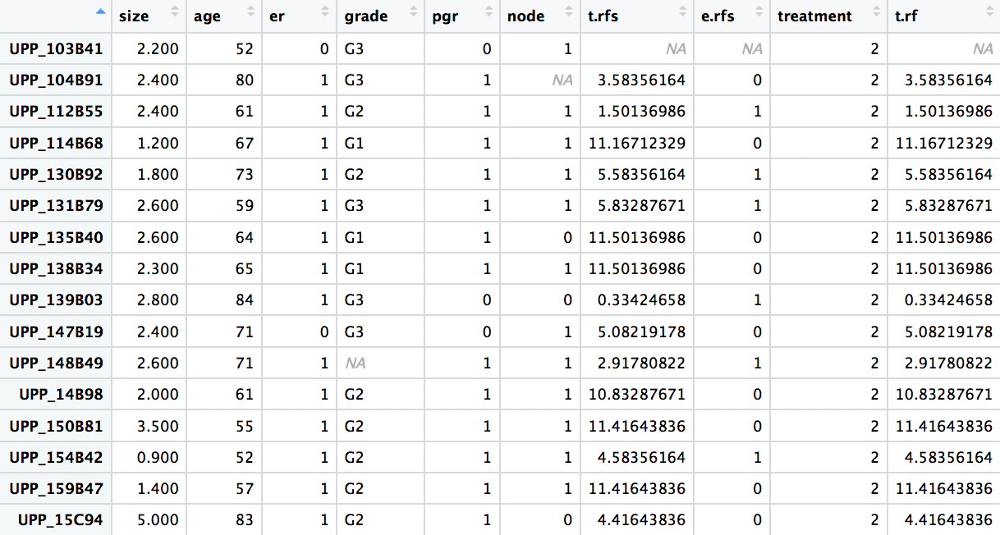
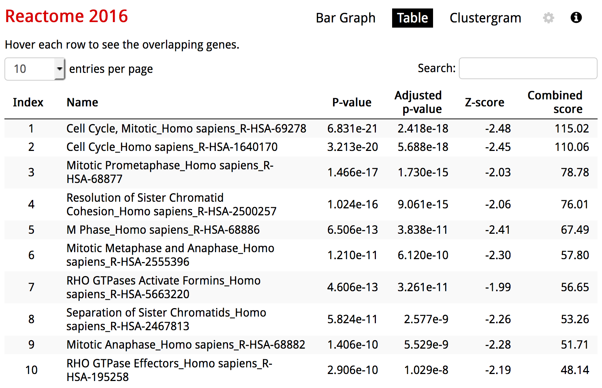
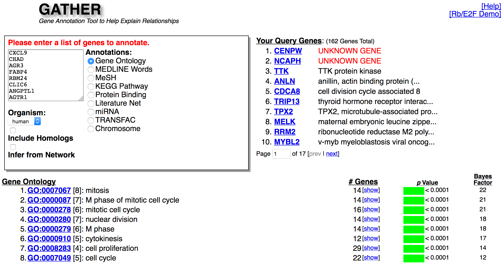
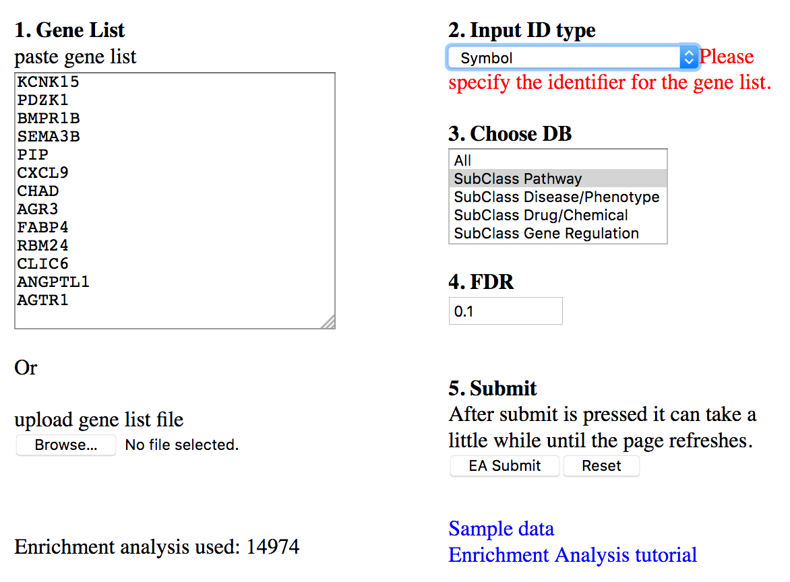
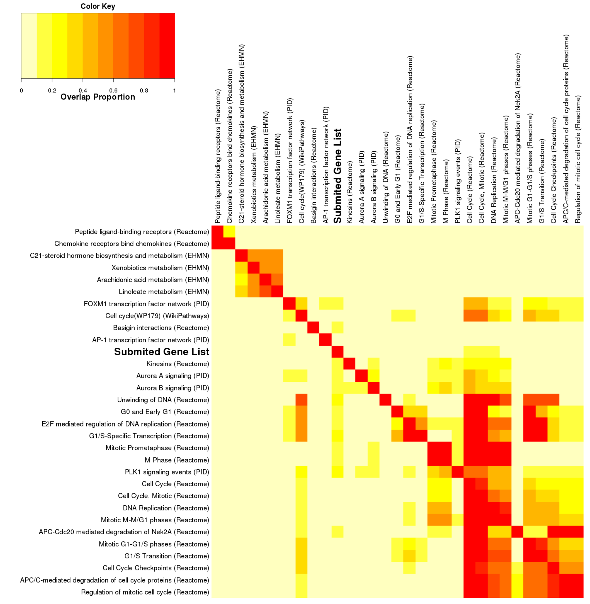
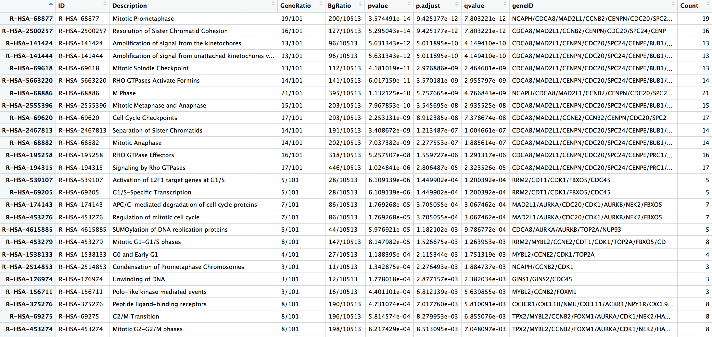

Downstream analysis for transcriptomic data
================
A/Prof Mik Black <BR> Department of Biochemistry <BR> University of Otago
BioHPC group: 4 April 2018

<!-- Run line below in R to render multiple documents: -->
<!-- rmarkdown::render(here::here("bioHPC_geneLists.Rmd"), output_format='all') -->
Gene lists
----------

-   There are **LOTS** of situations where we might want to use a list of genes to shed some biological light on our problem

-   Two typical situations:
    -   List of genes (e.g., differentially expressed between two conditions) that we want to gain some more insight (e.g., by including some additional biological annotation)
    -   List of gene representing a specific biological function (e.g., tissue-specific expression) that we would like to obtain an expression summary for.

Common types of annotation
--------------------------

-   Pathways
    -   Reactome
    -   KEGG
    -   WikiPathways
    -   Biocarta
-   Ontologies
    -   Gene Ontology
    -   Human phenotypes
    -   Tissue-specific expression

Situation 1
-----------

-   Over-representation analysis
    -   Enrichr
    -   GATHER
    -   GeneSetDB
-   Enrichment analysis
    -   GSEA
    -   Generic methods (limma): `roast`, `camera`, `wilcoxGST`

Situation 2: Metagenes!
-----------------------

-   Dimension reduction to produce summary of multi-gene data
    -   Centroids
    -   Principal Components Analysis (PCA)
    -   Singular Value Decomposition (SVD)
    -   Mutlidimensional Scaling (MDS)
-   Relationship to clinical/phenotypic variables

Example data set
----------------

-   Breast cancer data: Miller et al. (2005): `breastCancerUPP` package
    -   251 tumour samples on HGU133A/B Affymetrix microarrays
    -   44,928 probe sets
    -   10 clinical variables
-   Use these data to illustrate both situations described above (over-representation/enrichment and metagenes).

Setup
-----

``` r
## Load packages
library(breastCancerUPP)
library(ggplot2)
library(survival)
library(limma)
library(reactome.db)
library(ReactomePA)
library(survminer)
library(gplots)
library(dplyr)
library(WGCNA)
library(gridExtra)
```

``` r
## Helper function for ggplot colours
gg_color_hue <- function(n) {
  hues = seq(15, 375, length = n + 1)
  hcl(h = hues, l = 65, c = 100)[1:n]
}
```

Load breast cancer expression data
----------------------------------

``` r
data(upp)
expDat = exprs(upp)
upp
```

    ## ExpressionSet (storageMode: lockedEnvironment)
    ## assayData: 44928 features, 251 samples 
    ##   element names: exprs 
    ## protocolData: none
    ## phenoData
    ##   sampleNames: UPP_103B41 UPP_104B91 ... UPP_9B52 (251 total)
    ##   varLabels: samplename dataset ... e.os (21 total)
    ##   varMetadata: labelDescription
    ## featureData
    ##   featureNames: 1007_s_at 1053_at ... AFFX-TrpnX-M_at_2 (44928
    ##     total)
    ##   fvarLabels: probe Gene.title ... GO.Component.1 (22 total)
    ##   fvarMetadata: labelDescription
    ## experimentData: use 'experimentData(object)'
    ##   pubMedIds: 16141321 
    ## Annotation: hgu133ab

Extract gene symbols
--------------------

``` r
symbols = fData(upp)$Gene.symbol
names(symbols) = fData(upp) %>%  rownames()
head(symbols)
```

    ## 1007_s_at   1053_at    117_at    121_at 1255_g_at   1294_at 
    ##    "DDR1"    "RFC2"   "HSPA6"    "PAX8"  "GUCA1A"    "UBA7"

``` r
symbols %>%  is.na() %>% sum()
```

    ## [1] 8734

``` r
drop_na = symbols %>%  is.na() %>% which()
head(drop_na, 4)
```

    ##   201265_at   202225_at   202603_at 203326_x_at 
    ##         793        1753        2131        2853

Collapse probe-sets to symbols
------------------------------

-   `collapseRows` function in `WGCNA` package was used to generate per-gene data (e.g., single value when gene represented by multiple probe sets)
-   Default is to select the probe set with teh highest mean expression value.

``` r
uppExpr = WGCNA::collapseRows(expDat[-drop_na,], 
                 rowGroup = symbols[-drop_na], 
                 rowID = names(symbols[-drop_na]))$datETcollapsed
saveRDS(uppExpr, file='uppsala-brca-perGene.rds')
```

Examine collapsed data
----------------------

``` r
uppExpr = readRDS('uppsala-brca-perGene.rds')
dim(uppExpr)
```

    ## [1] 18821   251

``` r
head(uppExpr[,1:5])
```

    ##        UPP_103B41 UPP_104B91 UPP_112B55 UPP_114B68 UPP_130B92
    ## A1BG        6.750      7.356      7.631      7.189      7.333
    ## A1CF        6.866      6.711      7.036      7.060      6.857
    ## A2BP1       7.187      7.232      6.627      6.559      7.268
    ## A2LD1       7.245      6.994      6.751      6.484      6.918
    ## A2M         9.540      9.378      9.885      8.914      9.425
    ## A4GALT      5.673      5.520      5.015      5.622      5.536

Extract clinical data
---------------------

``` r
uppClin <- pData(upp)
dim(uppClin)
```

    ## [1] 251  21

``` r
names(uppClin)
```

    ##  [1] "samplename"    "dataset"       "series"        "id"           
    ##  [5] "filename"      "size"          "age"           "er"           
    ##  [9] "grade"         "pgr"           "her2"          "brca.mutation"
    ## [13] "e.dmfs"        "t.dmfs"        "node"          "t.rfs"        
    ## [17] "e.rfs"         "treatment"     "tissue"        "t.os"         
    ## [21] "e.os"

Extract relevant variables
--------------------------

``` r
uppClin %>% is.na() %>%  colSums()
```

    ##    samplename       dataset        series            id      filename 
    ##             0             0             0             0           251 
    ##          size           age            er         grade           pgr 
    ##             0             0             4             2             0 
    ##          her2 brca.mutation        e.dmfs        t.dmfs          node 
    ##           251           251           251           251             9 
    ##         t.rfs         e.rfs     treatment        tissue          t.os 
    ##            17            15            29             0           251 
    ##          e.os 
    ##           251

``` r
uppClin = uppClin[,c("size", "age", "er", "grade", "pgr", "node", 
                     "t.rfs", "e.rfs", "treatment")]
```

Tidy up Grade and RFS time
--------------------------

``` r
## Convert RFS time from days to years
uppClin$t.rfs = uppClin$t.rfs/365

## Convert grade from numeric (1,2,3) to G1, G2, G3.
uppClin$grade = paste0("G", uppClin$grade)
uppClin$grade[uppClin$grade=="GNA"] = NA

## Table of Grade vs ER status
table(uppClin$er, uppClin$grade, useNA='always', dnn=c("ER", "Grade"))
```

    ##       Grade
    ## ER      G1  G2  G3 <NA>
    ##   0      2  11  21    0
    ##   1     62 116  33    2
    ##   <NA>   3   1   0    0

Clinical data
-------------

``` r
View(uppClin)
```

<center>

</center>
Survival plot (RFS by Grade)
----------------------------

``` r
ggsurvplot(survfit(Surv(t.rfs, e.rfs) ~ grade, data=uppClin), 
           pval = TRUE, risk.table = FALSE) + xlab("Time (years)")
```


Differential expression (G1 vs G3)
----------------------------------

``` r
## Only keep samples which do not have NA values for grade
keep = which(!is.na(uppClin$grade))

## Create design marix for linear model analysis
design = model.matrix(~uppClin$grade)
head(design)
```

    ##   (Intercept) uppClin$gradeG2 uppClin$gradeG3
    ## 1           1               0               1
    ## 2           1               0               1
    ## 3           1               1               0
    ## 4           1               0               0
    ## 5           1               1               0
    ## 6           1               0               1

Differential expression (G1 vs G3)
----------------------------------

``` r
## Fit linear model
fit = lmFit(uppExpr[, keep], design) 
fit = eBayes(fit)

## Extract results
g3_vs_g1 = topTable(fit, coef=3, n=nrow(uppExpr), 
                    adjust.method="holm")
## Identify significant genes
sig = g3_vs_g1$adj.P.Val < 0.01 

## Number of significant genes
sum(sig)
```

    ## [1] 1472

Volcano plot
------------

``` r
volcanoplot(fit, coef=3)
points(g3_vs_g1$logFC[which(sig)], -log10(g3_vs_g1$P.Value[which(sig)]), 
       cex=0.4, col='red', pch=16)
abline(h = min(-log10(g3_vs_g1$P.Value[which(sig)])), lty=2, col='blue')
```


Add fold-change threshold
-------------------------

-   Can reduce the number of genes in our list by imposing a fold-change threshold
-   Here I've required genes to exhibit a fold-change of at least 2 (i.e., 1 on the *l**o**g*<sub>2</sub> scale) between the groups.

``` r
sigFC = (g3_vs_g1$adj.P.Val < 0.01)  & (abs(g3_vs_g1$logFC) > 1)
sum(sigFC)
```

    ## [1] 160

Volcano plot with FC threshold
------------------------------

``` r
volcanoplot(fit, coef=3)
points(g3_vs_g1$logFC[which(sigFC)], 
       -log10(g3_vs_g1$P.Value[which(sigFC)]), 
       cex=0.6, col='red', pch=16)
abline(h = min(-log10(g3_vs_g1$P.Value[which(sigFC)])), lty=2, col='blue')
abline(v = c(-1,1), lty=2, col='blue')
```


Significant genes
-----------------

``` r
sigGenes = rownames(g3_vs_g1)[which(sigFC)]
sigGenes %>%  head(.,30)
```

    ##  [1] "CENPW"           "NCAPH"           "TTK"            
    ##  [4] "ANLN"            "CDCA8"           "TRIP13"         
    ##  [7] "TPX2"            "MELK"            "RRM2"           
    ## [10] "MYBL2"           "MAD2L1"          "CCNE2"          
    ## [13] "CCNB2"           "SLC7A5"          "HJURP"          
    ## [16] "FOXM1"           "CEP55"           "DLGAP5"         
    ## [19] "UBE2S"           "CENPN"           "AURKA"          
    ## [22] "CDC20"           "SPC24"           "CENPE"          
    ## [25] "PRC1"            "FOS"             "ASPM"           
    ## [28] "FAM72A///FAM72B" "CDT1"            "BUB1"

``` r
strsplit(sigGenes, "///") %>%  unlist() %>%  unique() %>% length()
```

    ## [1] 162

Over-representation analysis: Enrichr
-------------------------------------

<center>

</center>
<BR> <http://amp.pharm.mssm.edu/Enrichr/>

Over-representation analysis: Enrichr
-------------------------------------

<center>

</center>
<BR> <http://amp.pharm.mssm.edu/Enrichr/>

Over-representation analysis: GATHER
------------------------------------

<center>

</center>
<BR> <http://changlab.uth.tmc.edu/gather/gather.py>

Over-representation: GeneSetDB
------------------------------

 

<BR> <http://genesetdb.auckland.ac.nz>

Over-representation: GeneSetDB
------------------------------


<BR> <http://genesetdb.auckland.ac.nz>

Over-representation analysis in R
---------------------------------

``` r
reactome()
```

    ## Quality control information for reactome:
    ## 
    ## 
    ## This package has the following mappings:
    ## 
    ## reactomeEXTID2PATHID has 69713 mapped keys (of 69713 keys)
    ## reactomeGO2REACTOMEID has 1880 mapped keys (of 1880 keys)
    ## reactomePATHID2EXTID has 22001 mapped keys (of 22001 keys)
    ## reactomePATHID2NAME has 22823 mapped keys (of 22823 keys)
    ## reactomePATHNAME2ID has 22795 mapped keys (of 22795 keys)
    ## reactomeREACTOMEID2GO has 11671 mapped keys (of 11671 keys)
    ## 
    ## 
    ## Additional Information about this package:
    ## 
    ## DB schema: REACTOME_DB
    ## DB schema version: 62

Reactome data
-------------

``` r
## Pathways and Entrez IDs (first 2 pathways, first 6 genes from each)
lapply( as.list(reactomePATHID2EXTID)[1:2], head )
```

    ## $`R-HSA-109582`
    ## [1] "1"     "10000" "10000" "10019" "10112" "10125"
    ## 
    ## $`R-HSA-114608`
    ## [1] "1"     "10184" "10257" "10447" "10487" "10490"

``` r
## Pathway names (first 2)
as.list(reactomePATHID2NAME)[1:2]
```

    ## $`R-ATH-73843`
    ## [1] "1-diphosphate: 5-Phosphoribose"
    ## 
    ## $`R-ATH-1369062`
    ## [1] "Arabidopsis thaliana: ABC transporters in lipid homeostasis"

`ReactomePA`
------------

``` r
## Convert gene list symbols to Entrez gene IDs
sigEntrez = fData(upp)$EntrezGene.ID[ match(sigGenes, 
                            fData(upp)$Gene.symbol) ] %>%  
            as.vector()
head(sigEntrez)
```

    ## [1] "387103" "23397"  "7272"   "54443"  "55143"  "9319"

``` r
## Perform pathway analysis via ReactomePA
rPAoverrep <- enrichPathway(gene=sigEntrez, organism = "human", 
                            pvalueCutoff=0.05, readable=T)
```

`ReactomePA` results
--------------------

``` r
rPAoverrep %>%  as.data.frame() %>%  View()
```

<center>

</center>
`ReactomePA` visualisations
---------------------------

-   NB: `barplot.enrichResult` is from the `DOSE` pacakge.

``` r
barplot(rPAoverrep, showCategory=11, font.size=8)
```


`ReactomePA` visualisations
---------------------------

-   NB: `dotplot` is from the `DOSE` pacakge.

``` r
dotplot(rPAoverrep, showCategory=11, font.size=8)
```


`ReactomePA`: GSEA
------------------

``` r
tstats = g3_vs_g1$t
names(tstats) = fData(upp)$EntrezGene.ID[ match(rownames(g3_vs_g1), 
                            fData(upp)$Gene.symbol) ] %>%  
                as.vector()
tstats = sort(tstats, decreasing=TRUE)
head(tstats)
```

    ##   387103    23397     7272    54443    55143     9319 
    ## 12.57173 12.31195 12.01225 11.89672 11.87608 11.44096

``` r
rPAgsea = gsePathway(tstats, nPerm=10000,
                     minGSSize=50, pvalueCutoff=0.2,
                     pAdjustMethod="BH", verbose=FALSE)
```

`ReactomePA`: GSEA results
--------------------------

``` r
rPAgsea %>%  as.data.frame() %>%  View()
```

<center>

</center>
`ReactomePA`: GSEA plot
-----------------------

``` r
gseaplot(rPAgsea, geneSetID = "R-HSA-69278")
```


Heatmaps
--------

-   Heatmaps are a great way to visualise the expression patterns of gene sets across samples.
    -   Incredibly overused (especially by me), and rather easy to abuse.
    -   Popular to use in conjunction with hierarchical clustering of rows (genes) and columns (samples).
-   Clusters often extracted for comparison with clinical/phenotypic variables.
-   Let's have a look at the expression of the genes in our list.

Heatmap setup
-------------

``` r
## Extract expression data for gens of interest
uppExprSig = uppExpr[match(sigGenes, rownames(uppExpr)), ]
dim(uppExprSig)
```

    ## [1] 160 251

``` r
## Use ggplot colours for Grades
gradeCols = gg_color_hue(3)[as.numeric(as.factor(uppClin$grade))]

## Identify which samples are Grade 1 or 3
g1_g3 = uppClin$grade%in%c("G1", "G3") %>%  which()
```

Heatmap: G1 & G3
----------------

``` r
heatmap.2(uppExprSig[,g1_g3], col=bluered(30), trace='none', 
          scale='row', ColSideColors = gradeCols[g1_g3], key=FALSE,
          breaks=seq(-3,3,l=31), labCol="", labRow="", mar=c(0,0))
```


Heatmap: all grades
-------------------

``` r
heatmap.2(uppExprSig, col=bluered(30), trace='none', 
          scale='row', ColSideColors = gradeCols, key=FALSE,
          breaks=seq(-3,3,l=31), labCol="", labRow="", mar=c(0,0))
```


Cluster groups
--------------

``` r
clusterGroups = uppExprSig %>%  t() %>% dist() %>%  
  hclust() %>% cutree(., 3)

table(clusterGroups)
```

    ## clusterGroups
    ##   1   2   3 
    ##  45 161  45

``` r
table(clusterGroups, uppClin$grade)
```

    ##              
    ## clusterGroups G1 G2 G3
    ##             1  1 11 33
    ##             2 62 91  6
    ##             3  4 26 15

Gene expression summaries
-------------------------

-   The clusters appear to relate (to some extent) to the tumour grades.
-   What if we want a continuous-valued variable to represent gene expression for each sample?
    -   Can sometimes use the *centroid* (mean of genes in set per sample - column means here)
    -   This works well when all the genes have a similar pattern...

``` r
centroid = colMeans(uppExprSig)
head(centroid)
```

    ## UPP_103B41 UPP_104B91 UPP_112B55 UPP_114B68 UPP_130B92 UPP_131B79 
    ##   6.291062   6.888775   6.802450   6.856950   6.799506   6.822463

Centroid boxplot
----------------

``` r
data.frame(centroid = centroid, grade=as.factor(uppClin$grade)) %>% 
     na.omit() %>% ggplot(., aes(x=grade, y=centroid, fill=grade)) + 
     geom_boxplot() + ggtitle("Centroid vs Grade")
```


Here it doesn't provide any distinction between grades.

Metagenes
---------

-   Dimension reduction technqiues are commonly used to generate metagenes:
    -   SVD/PCA/MDS
    -   these are all basically the same: <https://github.com/mikblack/msg-pca-20171114>
-   Other methods also exist:
    -   Non-negative matrix factorisation (NMF)
    -   Generally gives similar results to methods above

Metagene creation
-----------------

``` r
pca = uppExprSig %>% scale(., scale=FALSE) %>%  t() %>%  prcomp()
metagene = pca$x[,1:3]
head(metagene)
```

    ##                   PC1       PC2        PC3
    ## UPP_103B41 -18.934243 -1.767337 -1.8475819
    ## UPP_104B91  -3.307331  4.807649  3.7349320
    ## UPP_112B55   2.520988  6.358609 -4.6019407
    ## UPP_114B68   1.544139  2.879148  1.9585313
    ## UPP_130B92  11.289497  6.677049  2.5467931
    ## UPP_131B79  -4.422589  3.259645 -0.6350316

Percentage variance explained
-----------------------------

``` r
screeplot(pca)
```


Most of the variance is explained by the first eigenvector / PC.

Heatmap ordered by Metagene 1
-----------------------------

``` r
ord = order(metagene[,1])
mgCols = bluered(nrow(metagene))[rank(metagene[,1])]
heatmap.2(uppExprSig[, ord], col=bluered(30), trace='none', Colv=FALSE,
          scale='row', ColSideColors = mgCols[ord], key=FALSE,
          breaks=seq(-3,3,l=31), labCol="", labRow="", mar=c(0,0))
```


Setup for grade plots
---------------------

``` r
p1 = data.frame(PC1 = metagene[,1], grade=as.factor(uppClin$grade)) %>% 
     na.omit() %>% ggplot(., aes(x=grade, y=PC1, fill=grade)) + 
     geom_boxplot() + ggtitle("Metagene 1")

p2 = data.frame(PC2 = metagene[,2], grade=as.factor(uppClin$grade)) %>% 
     na.omit() %>% ggplot(., aes(x=grade, y=PC2, fill=grade)) + 
     geom_boxplot() + ggtitle("Metagene 2")

p3 = data.frame(PC3 = metagene[,3], grade=as.factor(uppClin$grade)) %>% 
     na.omit() %>% 
     ggplot(., aes(x=grade, y=PC3, fill=grade)) + 
     geom_boxplot() + ggtitle("Metagene 3")
```

Metagenes versus Grade
----------------------

``` r
grid.arrange(p1, p2, p3, ncol=3)
```


First metagene is strongly associated with grade: provides a good continuous-valued summary of proliferation level.

Genomic grade
-------------

-   In their 2005 publication, Miler et al. used "proliferation level" to split the Grade 2 tumours into two groups.
    -   low proliferation Grade 2 tumours behave like Grade 1
    -   high proliferation Grade 2 tumours behave like Grade 3
-   This result was validated in other data sets.
-   Let's try the same thing here.

Genomic Grade
-------------

``` r
prolif = ifelse(metagene[,1] < median(metagene[,1]), "High", "Low")
table(prolif, uppClin$grade)
```

    ##       
    ## prolif G1 G2 G3
    ##   High  9 63 52
    ##   Low  58 65  2

``` r
uppClin$gGrade = uppClin$grade
uppClin$gGrade[uppClin$grade=="G2" & prolif=="High"] = "G2/G3"
uppClin$gGrade[uppClin$grade=="G2" & prolif=="Low"]  = "G2/G1"
table(uppClin$gGrade)
```

    ## 
    ##    G1 G2/G1 G2/G3    G3 
    ##    67    65    63    54

Survival plot (RFS vs Genomic Grade)
------------------------------------

``` r
ggsurvplot(survfit(Surv(t.rfs, e.rfs) ~ gGrade, data=uppClin), 
           pval = TRUE, risk.table = FALSE) + xlab("Time (years)")
```


Metagenes from Reactome pathways
--------------------------------

``` r
reactomePath = as.list(reactomePATHID2NAME)
reactomePath = reactomePath[grep("Homo sapiens", reactomePath)]
reactomePath[ grep('immune', reactomePath, ignore.case = TRUE)] %>% 
  head(.,3)
```

    ## $`R-HSA-1280218`
    ## [1] "Homo sapiens: Adaptive Immune System"
    ## 
    ## $`R-HSA-1280215`
    ## [1] "Homo sapiens: Cytokine Signaling in Immune system"
    ## 
    ## $`R-HSA-5260271`
    ## [1] "Homo sapiens: Diseases of Immune System"

Metagenes from Reactome pathways
--------------------------------

``` r
## Get Entrez IDs for genes in Cytokine Signalling pathway
pathRows = as.list(reactomePATHID2EXTID)["R-HSA-1280215"] %>%  
  unlist() %>%  match(., fData(upp)$EntrezGene.ID) %>%  
  na.omit() %>%  as.vector()
head(pathRows)
```

    ## [1]  2110 18687 10045  5117  7389 18788

``` r
## Extract expression data for these genes
pathExprDat = uppExpr[fData(upp)$Gene.symbol[pathRows], ]
dim(pathExprDat)
```

    ## [1] 881 251

Immune response metagene
------------------------

``` r
## Use PCA to generate metagenes
pca = pathExprDat %>% scale(., scale=FALSE) %>%  t() %>%  prcomp()
metagene = pca$x[,1]
screeplot(pca)
```


IR metagene vs survival (ER neg)
--------------------------------

``` r
mgHilo = ifelse(metagene < quantile(metagene,0.2), "mgLo", "mgHi")
ggsurvplot(survfit(Surv(t.rfs, e.rfs) ~ mgHilo, subset=uppClin$er==0, 
           data=uppClin),pval=TRUE) + xlab("Time (years)")
```


